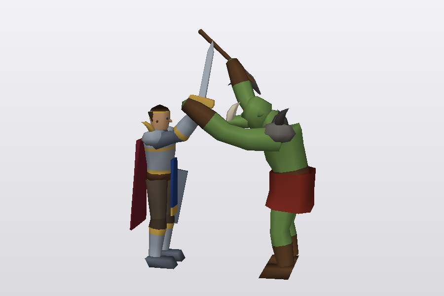
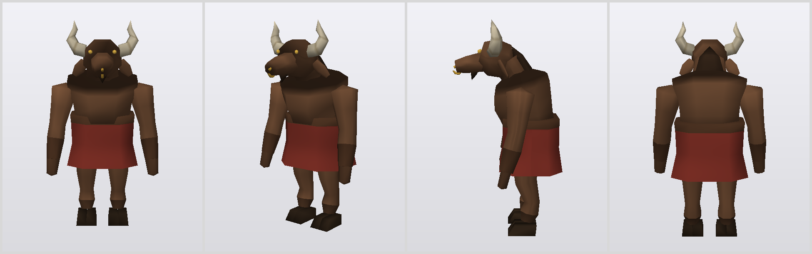
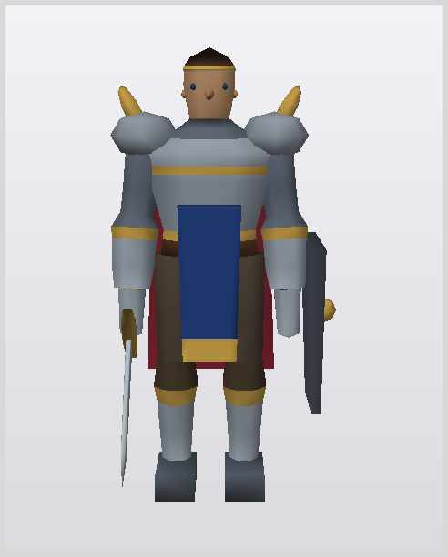
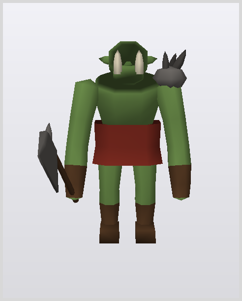
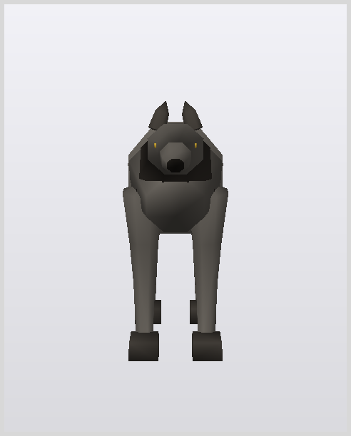
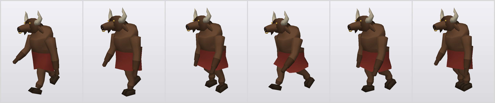
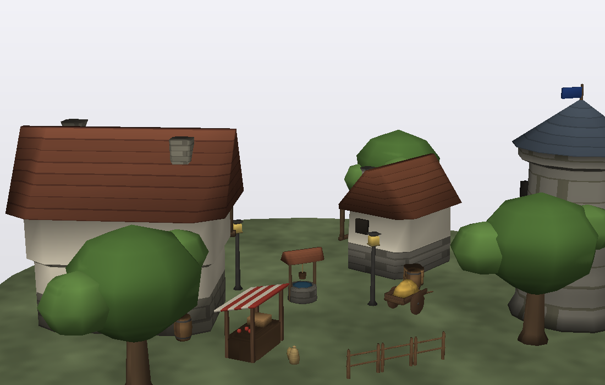
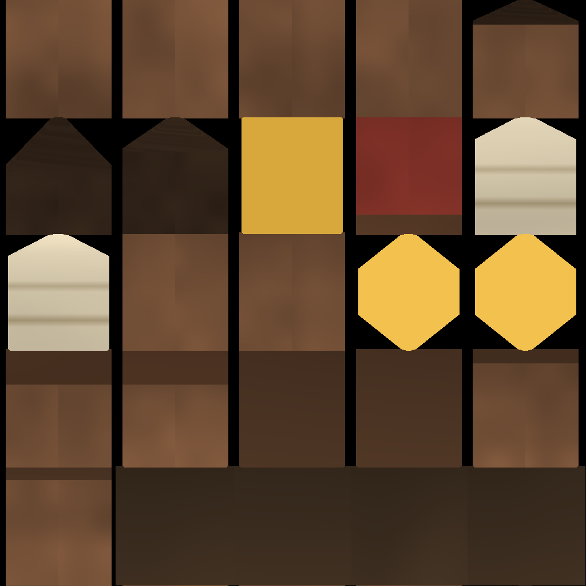

# WAM — WoW-ish Art Model language

A text language + compiler for **LLM-authored low-poly characters**: mesh,
skeleton, and animations from ~150 lines of readable source, compiled to
glTF 2.0 with software-rendered turntables for visual iteration.



The founding rule: the author only makes **discrete, named, relative,
symmetric** decisions — bone angles as words+degrees, body masses as
cross-section rings, symmetry via `mirror` blocks, props in local-frame
`group`s. The compiler generates every vertex, skin weight, normal, and
winding, and a semantic linter rejects the classes of silent geometry bugs
we hit while building the reference models (folds, wrong-bone bindings,
floating feet, inside-out faces).

| | | |
|---|---|---|
|  |  | |
|  |  | |



Models aren't limited to characters — `models/town/` holds twelve buildings
and props composed into a scene by `scripts/compose_town.py`:



A `textures` section gives materials a hand-painted look from named
procedural operators (gradients, noise, grain, bricks, planks, AO...),
baked into an auto-unwrapped texel atlas that ships inside the glTF:



## Quick start

```bash
python3 -m wam.cli models/tauren.wam            # compile + render 4-view sheet
python3 -m wam.cli models/tauren.wam --anim walk --frames 6
python3 -m wam.cli models/tauren.wam --bones    # skeleton overlay
```

Outputs land in `out/`: a skinned, animated `.gltf` (drops into
Blender/three.js/engines), PNG render sheets, the texture atlas, and a
`*_viewer.json` — open `viewer/template.html` in a browser and drop the
JSON onto it for an interactive orbit/animation view. Requires Python 3 + numpy.

A tiny sample of the language (see [SPEC.md](SPEC.md) for the full grammar
and `models/` for four complete reference models):

```
skeleton
  root pelvis at 0.52
  bone spine1 parent=pelvis dir=up pitch=13 len=0.13
  mirror
    bone thigh parent=pelvis side=0.07 dir=down pitch=-8 len=0.22
  end

parts
  loft torso bones=pelvis..spine2 material=skin
    ring 0.00 w=0.25 d=0.185 material=cloth
    ring 0.80 w=0.315 d=0.225
    cap start=dome end=dome

  group axe bone=hand.r at=1.0 dir=up pitch=45 yaw=-15
    loft haft at=(0,-0.03,0) dir=up len=0.47 material=leather
      ...
  end

animations
  anim walk loop dur=1.15
    ch thigh.l pitch 0%=-22 50%=19 100%=-22
    mirrorphase 50%
```

## Claude Code plugin

This repo is a Claude Code plugin: it ships a `wam` skill that teaches
Claude the language, the compile-render-iterate workflow, and the hard-won
authoring rules (gait timing, prop groups, cloth skinning, fold avoidance).

```
/plugin marketplace add elliottdehn/wam
/plugin install wam@wam
```

Then ask Claude for a model ("make a WoW-style troll") and it will author,
compile, and visually iterate using the bundled toolchain.

## Layout

- `wam/` — compiler: parser → skeleton solver → mesh generation → lint →
  glTF export, plus a dependency-free software rasterizer for the PNGs.
- `models/` — reference models: tauren, human footman, wolf, orc grunt.
- `SPEC.md` — the language specification.
- `viewer/` — template for a self-contained WebGL viewer page
  (`wam/viewer_export.py` produces the data blob to inject).
- `skills/wam/` — the Claude Code skill.
